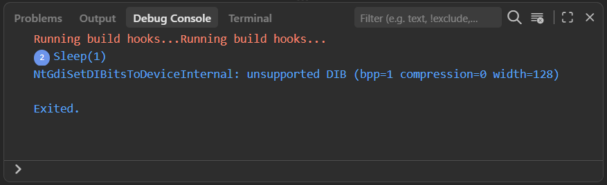

# Sogen Dart bindings

Native Dart FFI bindings for [Sogen](https://github.com/momo5502/sogen).

Sogen is an userspace emulator for Windows and Linux binaries. Every instruction, memory access and API call can be hooked, inspected, rewritten and the entire emulator state can be snapshotted and restored.

The Windows and Linux APIs cover factories and backend selection, execution,
snapshots and serialized state, memory and registers, scheduling, process and
thread views, diagnostics, ports, callbacks, modules and low-level hooks.
Windows also provides synchronous API observation/interception. Linux provides
symbol hooks and debugger controls.

## Build

Requirements:

- Dart 3.12 or newer (just install Flutter)
- Git

- On Windows, Visual Studio with the C++ desktop workload
- On Linux, a C++20 compiler and platform development headers
- On macOS, Xcode command-line tools

## Example

A ready-made emulation root containing a test sample, DLLs and more is available from <https://sogen.dev/root.zip>.

```dart
import 'package:sogen/ctypes.dart' show uint32;
import 'package:sogen/windows.dart' show apiCall, createApplication;

main() {
  final app = createApplication(r'c:/test-sample.exe', emulationRoot: './root');

  final onSleep = apiCall(
    cc: .stdcall,
    params: const [uint32],
    cb: (call, params) {
      final milliseconds = params[0];
      print('Sleep($milliseconds)');
    },
  );

  app.hooks.apis['Sleep'] = onSleep;

  app.start();
}
```

<details>
<summary>Output</summary>



</details>

## Security and license

Sogen is not a malware sandbox boundary. Emulation roots, path mappings,
network mappings and native dependencies might expose host resources. Run only
workloads appropriate for the host environment.

Sogen and these bindings are licensed under `GPL-2.0-only`.
